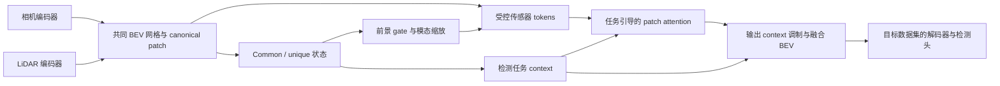

# nuScenes 的实验定位与 TaskDec 架构迁移边界

日期：2026-09-15。根据作者“为何 ASF / 3D-LRF / L4DR 未在 nuScenes 报告实验，以及希望保留架构贡献”的问题整理。本轮核对论文与实现，仅形成研究设计，不启动新的训练或数据下载。

**结论：没有证据将这些方法缺少 nuScenes 结果归因为未公开的性能失败；TaskDec 若迁移到 nuScenes，应迁移完整融合架构，保留各传感器独立特征进入 TaskDec 的路径。复用成熟编码器和检测头，与提出融合架构并不矛盾。**

## 三篇论文公开验证了什么

| 方法 | 已核对的公开实验范围与方法对象 | 对 nuScenes 选择的解释 |
|---|---|---|
| 3D-LRF | 在 K-Radar 上验证 3D LiDAR / 4D 雷达体素融合，以及天气条件雷达流门控；输入包括 LiDAR 点云与 4D 雷达张量 | 3D 邻域与雷达高度/体素结构直接关联其设计；更换雷达数据形式需要重新处理输入编码和融合关系 |
| L4DR | K-Radar、VoD 与模拟的 VoD-Fog；研究 LiDAR–4D 雷达融合、去噪与增强 | 保留 4D 雷达输入体系可以跨真实数据来源验证方法；nuScenes 属于另一种雷达输入分布 |
| ASF | K-Radar v1/v2，传感器组合、退化/失效、可视化与消融 | 公开实验围绕统一表征和可用性展开；ASF 的特征级架构较通用，不能据此声称它无法适配 nuScenes |

来源：[3D-LRF CVPR 2024 论文](https://openaccess.thecvf.com/content/CVPR2024/papers/Chae_Towards_Robust_3D_Object_Detection_with_LiDAR_and_4D_Radar_CVPR_2024_paper.pdf)、[L4DR AAAI 2025 论文，Datasets and Evaluation Metrics / VoD 实验](https://ojs.aaai.org/index.php/AAAI/article/view/32397/34552)、[ASF NeurIPS 2025 论文，§4](https://papers.nips.cc/paper_files/paper/2025/file/80bd5c815cdb033ac23eb27605adaaba-Paper-Conference.pdf)。关于“为什么不选择”的最后一列属于基于设计与数据的推断，不能当作作者披露的内部决策。

K-Radar 作者对数据集的比较将 nuScenes 列为提供常规 3D 雷达点云、未提供雷达张量的数据集，K-Radar 则提供包含 elevation 的 4D 雷达张量。这里雷达的 3D/4D 描述的是观测维度，与是否具有 3D 检测标注是两回事。nuScenes 仍有 3D 框以及雨天/夜间场景，不能写成“没有恶劣天气”或“不能做雷达融合”。[K-Radar 作者论文的数据比较](https://arxiv.org/html/2206.08171v3)

针对 nuScenes 的雷达稀疏与高度缺失，已有 Bi-LRFusion 等工作设计相应的 LiDAR–雷达融合方案，这也说明其适用方法与 4D 雷达张量路线不完全相同。[Bi-LRFusion CVPR 2023](https://openaccess.thecvf.com/content/CVPR2023/papers/Wang_Bi-LRFusion_Bi-Directional_LiDAR-Radar_Fusion_for_3D_Dynamic_Object_Detection_CVPR_2023_paper.pdf)

上述公开资料支持“研究范围、输入特性与评测问题存在差别”。目前未找到证据说明这些作者在 nuScenes 做过失败实验并选择隐瞒，也不能从未报告结果推出一定效果不好。将原方法直接用于新的雷达分布时优势可能变化，这是需要实验检验的假设。

## 架构贡献的实际范围

作者明确希望论文以任务感知解耦融合架构为主体。此前“在 BEVFusion 中加入 TaskDec”的措辞容易混淆两种不同方案，应统一改为：**复用目标数据集上的单模态编码器和检测接口，以完整 TaskDec 构建主融合路径。**

ASF 自身在 §3.1 明确复用 BEVDepth、SECOND、RTNH 编码器和既有检测头，并把主要贡献集中在融合网络。这是复用成熟组件仍可研究融合架构的直接例子。[ASF §3.1](https://papers.nips.cc/paper_files/paper/2025/file/80bd5c815cdb033ac23eb27605adaaba-Paper-Conference.pdf)

TaskDec 当前实现继承 ASF 的 canonical projection / patch attention 基础，并通过共享/特有状态、前景门控、模态缩放及任务上下文修改融合输入、query 和输出。论文应如实交代这一继承关系，将新增贡献落在表征如何组织、任务信息怎样引导交互以及相应学习目标上。不能仅凭重新命名或框架图调整扩大原创范围。

## 建议的 nuScenes 迁移结构（尚未实现）

这里的两路 BEV 特征是在模型前向中由编码器产生，不预设离线缓存、永久冻结或只训练一个小插件。编码器是否训练、初始化与 BN 处理根据实验预算确定，并对基线保持一致。

在这条路线中，BEVFusion 原生 ConvFuser 不作为另一段完整融合器保留在主路径中；其代码库可提供数据处理、相机/LiDAR 编码器、检测解码器与评测接口。TaskDec 在融合发生之前获得两路独立特征，并负责形成最终融合表征。如果先运行原生融合再仅加 gate/残差，或者只迁移 gate/scale 而取消 common/unique 和 task query/context，则应标为额外的适配变体，不能用它替代完整架构的外部验证。

现有 common/unique 代码产生学习状态，并非可辨识的严格信号分解；v1 的 task context 为 objectness，迁移到 nuScenes 的多类监督必须按实际实现说明。这些语义边界仍然适用，架构定位不改变已经核实的事实。

## 对照与叙事

主表方法可标为 `TaskDec (C+L)` 并在设置中说明编码器/检测头来源；只有上述完整路径实际实现并验证后才采用该名称。直接基线至少包括原生目标数据集融合器和相同 patch 融合结构但无 TaskDec 解耦控制的版本。这样分别量化原生融合、patch 交互以及任务解耦控制的作用。替换融合器本身并不自动证明新颖性，仍需完整计算链和受控实验支持。

数据集选择依研究范围决定：若主张聚焦 4D 雷达条件下的融合，Dual-Radar / VoD / V2X-Radar-V 都有直接价值，nuScenes 不是必选项；若主张覆盖更一般的多传感器局部融合，nuScenes C+L 可检验完整架构对另一数据源和模态组合的适用性。它也不能保证更大收益或投稿结果。

当前建议保留 nuScenes 作为完整架构迁移候选，先做代码接口与资源可行性核验。本轮仅做资料分析，没有新增训练或下载，也没有改变正在运行的 v2 ASF/L4DR 实验。
