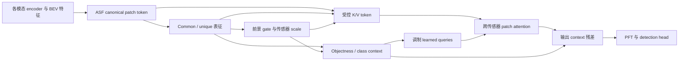

# TaskDec 项目总体梳理与论文行文复核

资料基准日期：2026-09-09；整理完成日期：2026-09-10。

视觉排布更新：作者进一步要求保留独立动机、主框架、正文 PCA，并增加真实 BEV gate 与实车检测对比。本文第八节的精简图表数量建议由 [最新图表安排](taskdec_figure_table_inventory_and_placement_260910.md) 中的 5 图＋4 个紧凑表方案替代；已有结果和方法核对仍适用。

本次以 [中文正文、附录与结果索引](taskdec_iclr27_chinese_main_appendix_and_result_index_260909.md) 为入口，交叉阅读方法发展记录、论文组织建议、各实验结果汇总、主模型与变体配置、融合与损失实现，以及可视化导出代码。以下区分实现事实、现有实验观察和仍需验证的解释。本次完成文档与结果核对，没有重新训练或运行完整检测评测；当前代码与历史 checkpoint 对应代码是否完全一致，仍须在复现记录中固定。

2026-09-10 作者补充：移除项也经过 1000 样本小测后选择最优对比结果；主表采用官方 ASF checkpoint；v2 标注早期变体；VoD 以原生强基线上的泛化收益为重点。本文据此修正此前对消融选择流程的推断，并更新写作安排。小测的具体样本清单、选择指标及候选范围尚未在本轮逐条核对，不将这些细节视为已经验证。

**一、总体判断：项目的主线已经明确，可以按主基准、组件证据与泛化三层组织论文。**

TaskDec 最有价值的研究问题是：在不同传感器已经被映射到统一空间后，如何利用任务相关的表征结构，控制各模态信息进入融合的方式？项目已经实现了从 canonical patch token、common/unique 表征，到前景门控、传感器缩放和任务上下文的完整计算链。

现有材料可以支撑正文初稿：官方 ASF checkpoint 提供主基准比较，经过小测选择的移除实验提供组件证据，VoD 原生 PP 实验提供跨数据集与骨干适配证据。论文主张可集中为：**任务监督下的 common/unique 表征能够指导局部融合控制，并在主基准和原生 VoD 强基线上取得所报告的收益。** v2 使用早期控制器，RC 是缺模态的主要失效组合，这两点在对应段落与表注中说明。

建议统一方法名称为 `TaskDec`；`Robust`、`Balanced`、`Strong` 保留作具体实验配置名。正文直接说明基于 ASF 的 canonical patch fusion 实现，并把贡献集中在新增的解耦控制机制上。是否构成有说服力的架构贡献，取决于机制和证据，而不取决于框架图里 ASF 方框的大小。

推荐工作标题：

> TaskDec: Task-Aware Decoupled Control for Multi-Sensor 3D Detection

推荐中文定位句：

> TaskDec 在统一 canonical patch 空间中学习跨模态共享表征和模态特有表征，并将这些表征用于前景相关的传感器缩放与任务上下文调制，从而控制多传感器 3D 检测中的局部融合。

“patch-level evidence availability”可以作为动机用语；方法中应落到可计算的 gate、scale 和 context，避免把它写成已经获得真实标签、经过校准的“证据可用概率”。

**二、项目发展脉络与各目录的职责。**

历史记录显示，项目的关键变化在于控制粒度与解耦表征用途的变化。下表用于理解研究来源，不宜直接变成论文引言里的开发流水账。

| 阶段 | 主要设计 | 对当前项目的意义 |
|---|---|---|
| WCBR / DeCU 早期探索 | 天气或条件 token 控制分支，随后引入 common/unique 表征 | 提出不同传感器应按条件使用的动机；历史记录中出现路由偏向单一模态的问题 |
| DeCU 与 ASF 桥接 | 将全局表征变成 ASF query 的偏置 | 暴露全局控制与局部 patch 融合之间的不匹配 |
| PatchDec | 在 canonical patch 上学习 common/unique，加入监督和残差 | 找到与检测空间对应的操作粒度 |
| ForegroundGated PatchDec | 前景门控控制残差 | 把控制强度与目标相关区域联系起来 |
| DecControlledA2Fusion | 解耦状态生成 gate 和传感器缩放 | 解耦表征直接影响融合输入；当前 v2.0 正向补充结果来自这一阶段 |
| TaskAwareDecControlledA2Fusion | 增加 objectness/class context，调制 query 与融合输出 | 当前 K-Radar v1.0 主方法 |
| Native VoD TaskDec-PP | 将完整控制机制适配到 PP 风格 L+R 特征 | 提供外部数据集上的架构适配实验 |

来源：[方法发展脉络](../METHOD_DEVELOPMENT_TRAJECTORY.md)。该文件包含多个日期追加的状态，较早的“待复验”和“当前最好”不能当作今天的统一状态。

| 目录或文件 | 当前职责 |
|---|---|
| `models/fuser/patch_dec_a2_fusion.py` | 四代融合类及主方法实现；是写公式的首要依据 |
| `models/fuser/a2_fusion.py` | ASF 融合基础实现 |
| `models/skeletons/fusion_base_integrated.py` | encoder、fuser、head 与联合损失的集成 |
| `configs/` | 方法开关与超参数；需要递归解析 `_BASE_CONFIG_` |
| `logs/` | 训练、评测、checkpoint 和运行配置 |
| `results/` | 结果汇总、协议说明和写作材料；不同文档存在过时段落 |
| `analysis_exports/`、`tools/analysis/` | 导出的表征、PCA、gate 统计与生成脚本 |
| `paper_figures/` | 已有 ASF/TaskDec 流程与 controller 的 SVG 草稿 |
| `vod_taskdec_native/` | 当前有可用检测指标的 VoD 原生 PP 适配线 |
| `vod_taskdec_lr/` | 较早的 VoD 工程探索；写最终结果时应明确区分 |
| `/home/hongsheng/K-Radar-main` | 官方 ASF checkpoint、日志及对照结果 |

核对入口索引提到的 103 个不同本地路径，均存在。路径存在说明材料可定位，不等于其中所有数字、状态说明和实验解释都已一致。

**三、方法的实际计算链，以及论文应如何解释。**

设可用模态集合为 \(\mathcal M\)，模态 \(m\) 在 patch \(p\) 的 canonical token 为 \(x_{m,p}\)。主实现继承 ASF 的投影、patch attention、PFT 和检测头接口。新增部分位于 attention 输入、query 和输出三个位置。

图为计算关系示意。GT 框只在训练时构造监督目标，不是推理控制器的输入；三路控制均由特征预测。gate 与 context 的乘法在图中作了合并表示。

1. **Common/unique 表征学习。** 每个模态使用各自的 MLP：

   \[
   c_{m,p}=C_m(x_{m,p}),\qquad u_{m,p}=U_m(x_{m,p}).
   \]

   代码对 GT 框覆盖并扩展 margin 后的 patch 施加三种约束：common 跨模态 cosine 对齐、unique 跨模态 cosine 的 margin 惩罚，以及同模态 common/unique 的绝对 cosine 惩罚。它们提供表征分离的归纳偏置，但没有重构约束要求 \(x=c+u\)，也没有证明统计独立性或语义可辨识性。正文宜写“学习共享与特有状态”，不要把 unique 直接等同于噪声，也不要把 common 直接等同于已经识别出的纯目标成分。

2. **前景门控与传感器缩放。** 控制器先计算：

   \[
   \bar c_p=\operatorname{mean}_{m}c_{m,p},\qquad
   \bar u_p=\operatorname{mean}_{m}|u_{m,p}|.
   \]

   主配置下 \(g_p=\sigma(G([\bar c_p,\bar u_p]))\)。传感器打分使用原始 token、common、unique 及 common 相对均值的偏离：

   \[
   r_{m,p}=\operatorname{softmax}_{m}
   \left(S_m([x_{m,p},c_{m,p},u_{m,p},|c_{m,p}-\bar c_p|])/T\right).
   \]

   \[
   s_{m,p}=\operatorname{clip}
   \left(1+\gamma g_p(|\mathcal M|r_{m,p}-1),s_{\min},s_{\max}\right),
   \qquad
   x'_{m,p}=s_{m,p}\left[x_{m,p}+\alpha g_p(c_{m,p}+u_{m,p})\right].
   \]

   这是最应强调的控制关系：分离后的状态进入传感器评分和前景控制，改变后续 attention 的 K/V。`reliability` 是该学习权重的功能名称，当前没有真实可靠性标签或校准实验。

3. **任务上下文调制。** 主 v1.0 是 Sedan 单类，代码自动使用 binary objectness context：

   \[
   h_p=\tanh\left(W_h\,\sigma(H([\bar c_p,\bar u_p]))\right),
   \qquad q'_{p,j}=q_j+\beta_qg_ph_p,
   \]

   \[
   z_{p,j}=\operatorname{Attn}(q'_{p,j},\{x'_{m,p}\},\{x'_{m,p}\}),
   \qquad z'_{p,j}=z_{p,j}+\beta_zg_ph_p.
   \]

   \(j\) 表示同一 patch 的多个 learned queries；实现将相同 context 广播到这些 queries。v1.0 的 context 由一个 objectness 概率投影而来，不能描述成丰富的多类别语义推理。gate 回答控制强弱，context 提供注入 attention 的任务方向；两者监督相关，论文仍需通过受控消融说明各自作用。

4. **训练目标。** 代码先将全部新增辅助项组合，再乘外层 `PATCH_DEC_WEIGHT`：

   \[
   \mathcal L=\mathcal L_{det}+\lambda_{scl}\mathcal L_{scl}
   +\lambda_{aux}\left(
   \lambda_o\mathcal L_{orth}+\lambda_c\mathcal L_{common}
   +\lambda_u\mathcal L_{unique}+\lambda_g\mathcal L_{gate}
   +\lambda_t\mathcal L_{task}\right).
   \]

   主配置 \(\lambda_{aux}=0.12\)，括号内权重依次为 0.10、0.12、0.015、0.15、0.30；entropy/balance 权重为零。SCL 是继承的单模态及模态组合检测监督。论文若将外层权重吸收到各项系数，需要在附录说明，避免配置与公式表不一致。

方法写作还需修正两点。第一，\(r_{m,p}=1/|\mathcal M|\) 时只有 scale 变成 1，dec residual 和 context 仍在；在主配置 gate 下，关闭所有额外调制才回到 ASF 形式的前向融合，训练得到的参数也不因此相同。第二，encoder 参数冻结不意味着全部特征统计固定：基础配置为 `FREEZE=True`、`FREEZE_BN=False`，BN 状态必须在复现说明中单列。

实现依据：[融合代码](../models/fuser/patch_dec_a2_fusion.py)、[联合损失](../models/skeletons/fusion_base_integrated.py)、[主配置](../configs/ASF_task_dec_controlled_robust_v1_0.yml)、[基础配置](../configs/v1_0/cfg_A2F_scl_final.yml)。

**四、实验材料已经回答了什么。**

下表按照“能支持的结论”组织，而不按实验完成时间组织。

| 实验 | 核对后的关键观察 | 可承担的论证任务 |
|---|---|---|
| K-Radar v1.0 主结果 | 主 checkpoint 在 conf=0.3 下 AP3D@0.3=88.36、AP3D@0.5=67.50 | 与官方发布 ASF checkpoint 及已收集文献行的性能比较 |
| 天气分解 | 相对发布 ASF，Normal、Rain、Light snow 的 AP3D@0.3 增益较大；Fog、Heavy snow 略低 | 定位总体收益出现在哪些天气子集 |
| 四项组件移除 | 作者确认移除项也经过 1000 样本小测选择；表中 model_9 的 AP3D@0.3 为 79.62–80.23 | 支持各组件在所采用选择流程下的有效性；不同 epoch 编号本身不构成不公平证据 |
| 缺模态推理 | LR +2.04、LC +6.88、RC −8.07 AP3D@0.3，均相对发布 ASF | 说明能力和边界依赖保留的传感器组合 |
| K-Radar v2.0 | 早期 DecControlled 的 selected-weather AP3D@0.5 有正增益；完整 TaskDec Robust final 的结果不同 | 区分控制器家族扩展与完整主架构验证 |
| VoD native PP | warm-start TaskDec epoch 79 的 EAA/DC 为 70.18/83.79；PP-Concat 为 69.88/83.80 | 说明架构可适配，且当前设置下 EAA 有小幅收益 |
| PCA 与 gate | common 在二维投影中跨模态中心更近；采样前景 gate 高于背景 | 描述学习状态及控制行为，提供机制诊断 |
| 效率 | 参数 +1.34M（约 1.7%）；forward +6.50 ms（约 8.1%） | 说明融合控制的实测开销 |

**v1.0 主表采用官方 ASF checkpoint，其他对照作为协议诊断。**

下表是内部复核汇总；正文主表采用官方发布 checkpoint 在 conf=0.3 下的结果。本地重训及其他阈值进入附录协议敏感性分析，不替换官方主对照。

| 对照 | conf | APBEV@0.5 | AP3D@0.5 | APBEV@0.3 | AP3D@0.3 |
|---|---:|---:|---:|---:|---:|
| ASF 发布 checkpoint / exp250303 汇总 | 0.3 | 80.33 | 67.19 | 80.78 | 80.31 |
| TaskDec Robust model_0 | 0.3 | 88.10 | 67.50 | 88.84 | 88.36 |
| ASF 本地重训 model_2 | 0.3 | 80.36 | 67.49 | 89.01 | 88.57 |
| ASF 发布 checkpoint / exp250303 汇总 | 0.0 | 86.97 | 72.95 | 88.59 | 87.34 |
| TaskDec Robust model_0，full summary | 0.0 | 87.18 | 72.83 | 88.84 | 88.06 |

采用官方发布 checkpoint 作为主要对照，可以明确模型来源并便于他人复核。正文统一写“相对同评测协议下的官方发布 ASF checkpoint”；组件作用由单独的移除实验论证。本地 ASF 的 88.57 保留为 checkpoint/协议敏感性记录，用于限定跨训练运行的结论；本地重训对照不再列为当前正文写作的前置要求。

对于 conf=0.0，同一发布 checkpoint 下 AP3D@0.3 的差值约 +0.72，AP3D@0.5 约 −0.12。置信度阈值是预测预过滤阈值，与 IoU 匹配阈值不同。需在正文写清两者，并在附录报告阈值敏感性。现有差异提示应检查分数分布、precision–recall 和最大 recall；它们还没有单独证明“改善了校准”或“提升来自定位”。

数值精度也需要统一：原始 JSON 中主模型约为 88.355033，ASF 约为 80.313467，直接相减约为 8.041566，四舍五入是 **+8.04**。旧稿 +8.05 来自展示值 88.36−80.31。建议最终表格从原始数值统一生成 delta；摘要可以写“约 8.0 个 AP 点”。本地 ASF AP3D@0.5 的 67.49/67.51 也来自不同评测汇总，应固定来源，不交叉拼表。

来源：[TaskDec 原始 JSON](exp_260812_232650_TaskDecControlRobust_v1_model0_full/summary_conf0.3.json)、[ASF 原始 JSON](/home/hongsheng/K-Radar-main/results/official_asf_v1_exp250303/summary_conf0.3.json)、[本地 ASF 重训 JSON](exp_260818_202519_ASF_v1_0_local_repro_model2_full/summary_conf0.3.json)、[协议核对](asf_v1_conf_protocol_audit_260828.md)、[完整评测审计](full_eval_metric_audit_260821.md)。

**天气结论应按具体比较对象写。**

| 天气 | TaskDec AP3D@0.3 | ASF AP3D@0.3 | 差值，原始值相减 |
|---|---:|---:|---:|
| Normal | 87.66 | 79.57 | +8.08 |
| Overcast | 90.39 | 89.89 | +0.51 |
| Fog | 90.57 | 90.67 | −0.10 |
| Rain | 88.90 | 80.97 | +7.93 |
| Sleet | 80.42 | 80.20 | +0.22 |
| Light snow | 89.28 | 80.89 | +8.39 |
| Heavy snow | 71.41 | 71.71 | −0.30 |

原索引“Normal、Rain、Sleet 优势明显”需要修改。Sleet 在已有 compact 文献表中排名最高，但相对直接 ASF 对照仅 +0.22；Light snow 相对 ASF 的增益反而较大，同时仍低于所收集 AW-MoE 的 90.20。建议写：“相对发布 ASF，增益主要见于 Normal、Rain 和 Light snow；Sleet 小幅提高，Fog 与 Heavy snow 略有下降。”这比把所有 adverse-weather 条件合并描述更准确。来源：[compact 天气表](paper_main_table_kradar_v1_weather_compact_260901.md)及上述原始 JSON。

**五、依据作者澄清确定的实验写作口径。**

**1. 消融按小测选择后的结果比较，不要求所选 epoch 编号相同。**

[组件表](taskdec_v1_component_ablation_conf0_3_260901.md)中，完整方法列出 `model_0`，四项移除列出 `model_9`。作者补充说明，移除项同样进行过 1000 样本小测，再选取最优对比结果。因此撤回此前仅凭 epoch 编号就确认存在选择混杂的判断；完整模型后期结果接近移除项，也不能推翻经过选择后的组件比较。

当前重点是将已经执行的选择流程写进实验设置：1000 样本小测的来源、评价指标、候选范围、所选 checkpoint 和最终全量结果。依据作者说明可写“完整模型和移除项均经过 1000 样本小测选择后报告全量评测”，但在日志核对前不额外声称使用了完全相同的样本 ID、搜索预算或独立验证集。可以保留组件表并说明“移除任一组件均降低所报告的 AP3D@0.3，支持各部分的作用”；不能将这些差值相加，或将其解释为每项组件在任意设置下固定贡献约 8 AP。

消融名称也应准确：`w/o reliability` 实际令缩放强度为零；`w/o foreground gate` 把控制 gate 固定为 1；`w/o decoupling supervision` 保留 common/unique 分支，只移除其三项监督；`w/o task context` 同时移除任务损失和 query/output 注入。这些都是有效的设计问题，但不能解释成删除了所有相关结构。

**2. v2.0 正向表没有使用完整 TaskDec。**

[v2.0 推荐表](paper_supp_table_kradar_v2_generalization_260901.md)引用的 [运行配置](exp_260806_000825_DecControlledASFStrong_final/config.yml)明确为 `DecControlledA2Fusion`，没有 task context。项目中另有 [完整 TaskDec Robust v2.0 结果](exp_260821_002150_TaskDecControlRobust_v2_0_final/summary_conf0.3.md)。将两者放在一起后，结论如下：

| v2.0 模型 | Sedan Total AP3D@0.5 | Bus/Truck Total AP3D@0.5 | Sedan selected AP3D@0.5 | Bus/Truck selected AP3D@0.5 |
|---|---:|---:|---:|---:|
| ASF 发布 checkpoint | 52.09 | 31.06 | 52.25 | 38.22 |
| DecControlled Strong，无 task context | 52.14 | 33.97 | 54.79 | 42.29 |
| TaskDec Robust final，有 task context | 51.76 | 30.75 | 54.09 | 36.73 |

selected 是 Overcast、Rain、Light snow、Heavy snow 四项的未加权平均，既不是 Total，也不是全部恶劣天气均值。原推荐文档明确提到 Sleet 中 Bus/Truck 略降而将其留在扩展表，因此选定均值不能承担“全面恶劣天气泛化”的结论；应列全天气和样本数，并说明子集定义。

正文对 v2 的说明保持简短：“K-Radar v2.0 的补充结果采用早期 DecControlled 变体，不包含 task-context 分支。” 表内使用 `DecControlled (early variant)`，完整配置及其他运行结果留在附录/复核记录。该结果支持解耦控制思路的扩展性，不用于替代完整 TaskDec 的验证。跨版本训练不称为零样本迁移。

**3. LR/LC 是正向缺模态证据，RC 用一句话交代边界。**

按 AP3D@0.3，RLC、LR、LC 相对官方 ASF 均有正向差值；LR 为 +2.04、LC 为 +6.88，RC 为 −8.07。LR 在 AP3D@0.5 上为 71.68 对 71.98，基本接近但略低 0.30；LC 在 AP3D@0.5 上也提高 6.20。因而“除 RC 外整体表现较好”符合当前结果，“除 RC 外每项指标都更好”则不准确。正文先报告 LR/LC，再以一句话说明 RC 退化；完整组合与指标保留在表中。

这与 reliability readout 的 LiDAR 偏向相一致，但还不是因果证明。softmax 概率接近 1 也不等于其余模态被完全丢弃：实际作用的是有界 scale，原始 token 仍然进入 attention。可以结合这两种观察讨论依赖性，不应直接说发生硬路由塌缩。

LR 的最终值应采用 [完整评测审计中的 saved-prediction recompute](full_eval_metric_audit_260821.md)，不能从索引链接的旧 `full_eval_summary` 直接复制。当前 [availability 表](paper_availability_missing_modalities_260902.md)已给出 LC 指标，但末尾仍写“LC did not start”，属于过时状态说明。

**4. VoD 围绕原生强基线上的泛化收益组织。**

最新 [VoD 汇总](paper_vod_main_table_draft_260909.md)覆盖 KITTI AP_R40 和官方 EAA/DC 两套指标。前者 best-Moderate 是 epoch 73，后者当前推荐 epoch 79；同一 epoch 73 的官方 EAA 只有 68.55。因此不能把不同 checkpoint 的最佳指标拼成一个模型行。

当前结果支持一个具体的泛化结论：TaskDec 可适配到原生 VoD PP 风格 L+R 骨干，在所报告的 warm-start 设置下，将强 PP-Concat 基线的 EAA 从 69.88 提高到 70.18，DC 保持接近（83.80→83.79）。PP-Concat 的 EAA/DC 已接近已收集文献中 InterFusion 的 69.83/83.80，可以说明该适配实验并非只与很弱的基线比较。正文围绕该结果展开；mild 控制、warm-start、AMP/FP32 和训练预算写入设置或表注。无需把额外匹配实验设为当前写作的前提，也不将单次 +0.30 描述为统计显著或任意训练条件下的稳定收益。

VoD 中的“泛化”定义为在目标数据集重新训练后的架构适配能力。L4DR 在 K-Radar 主表与相关工作中作为重要 L+R 方法充分比较，并保留模态标识；VoD 泛化段只需一句“专门的 VoD 方法 L4DR 仍取得更高绝对性能”，完整数值留在对照表中。不同 R+C 与 L+R 文献行作为背景，不宣称统一 SOTA。RPGFusion 行在现有资料中仍标注二手数值，正式表格前应核对原始论文。

可直接使用的 VoD 段落：

> 为验证架构在不同数据表示与骨干上的适用性，我们将 TaskDec 适配到 VoD 的原生 PointPillars 风格 LiDAR–4D radar 检测管线，并在目标数据集上训练。采用所报告的 warm-start 设置，TaskDec 将强 PP-Concat 基线的 EAA mAP 从 69.88 提高到 70.18，同时维持接近的 DC mAP（83.79 对 83.80），支持解耦控制机制在 K-Radar 之外的适用性。专门的 VoD 方法 L4DR 仍具有更高的绝对性能。

**六、可视化应该承担的解释任务。**

现有 weather-balanced 导出为每种天气 24 帧、共 168 帧，得到 78,588 条采样 patch 记录。前景 gate 均高于背景；例如 Normal 为 0.2512/0.1204，Fog 为 0.3004/0.1068。它们支持“模型学到了与前景相关的控制响应”，但天气之间也存在目标分布、距离等混杂，不能解释成天气退化直接导致 gate 增强。

导出代码对 raw/common/unique 分别拟合二维 PCA，没有统一做特征范数归一化；中心距离是在各自投影空间测量。common 中心距离较小可作为描述性诊断，不能单凭绝对欧氏距离证明原空间严格对齐、去噪成功或目标语义被分离。建议正文 caption 写明二维投影与采样范围，删去未经统计检验的“显著”；如需要更强的量化解释，可用已有原空间导出补算归一化后的同 patch 跨模态 cosine，并加入无解耦监督的匹配对照。

优先使用一张合并图展示代表性 PCA 和前景/背景 gate。reliability 读数放附录，和 RC 缺模态退化共同讨论。已有 [表征图](../analysis_exports/taskdec_paper_visuals_260909/paper_fig_taskdec_pca_representative.pdf)、[距离与门控图](../analysis_exports/taskdec_paper_visuals_260909/paper_fig_taskdec_decoupling_and_gate.pdf)可以继续使用，但解释强度应按上述边界收紧。

来源：[PCA 导出代码](../tools/analysis/export_taskdec_patch_pca.py)、[绘图代码](../tools/analysis/plot_taskdec_weather_pca.py)、[采样分析](../analysis_exports/taskdec_patch_pca_weather_260909/pca_weather_analysis.md)。

**七、正文应按“问题—机制—验证—边界”推进。**

引言不需要复述全部历史，也不需要逐个罗列四个模块。建议用四段完成逻辑递进。

第一段提出局部证据差异：多传感器可同时工作，但某一目标附近的观测质量可能不同。由此引出局部融合控制，而不是默认整幅场景共享一个传感器偏好。

第二段准确承接 ASF：canonical patch 表示提供跨传感器交互的空间，attention 已经能学习融合关系；本文提出的额外问题是，是否可以通过显式的任务监督表征分离，为融合控制提供更有结构的输入。不要把已有 attention 描述成完全不会选择或不会感知可靠性。

第三段讲统一机制：common/unique 状态同时服务于传感器评分、前景 gate 和 objectness context；gate 限制控制强度，context 改变 queries 和融合输出。三种控制来自同一组状态，因而可以作为一套方法描述。

第四段给结果与边界：报告 v1.0 的明确协议和主要数字，再以组件移除、LR/LC 缺模态表现与 VoD 强基线增益支持方法。v2 早期变体和 RC 退化在对应小节简要说明，不把它们推广成完整架构的全面泛化结论。

可直接展开为初稿的引言核心段：

> 多传感器 3D 检测需要在不同观测质量下利用互补信息。即使 camera、LiDAR 与 4D radar 同时可用，它们在同一空间区域中提供的检测信息也可能不同。因此，融合不仅需要建立不同模态之间的空间对应，还需要决定局部特征应以何种强度参与目标预测。
>
> 以 ASF 为代表的 canonical patch fusion 为这一问题提供了统一的交互空间。本文研究在该空间中引入任务监督的表征分离：为每个模态学习跨模态对齐的 common 状态和保留模态差异的 unique 状态，并将其作为局部融合控制的输入。这样的设计使表征学习与融合行为通过显式计算路径相连。
>
> 我们提出 TaskDec，由解耦状态生成前景 gate、传感器缩放和任务上下文。前景 gate 调节控制强度，传感器缩放作用于 attention 输入，任务上下文进一步调制 queries 与融合输出。训练使用 3D 标注构造 patch 级监督，推理时全部控制信号由输入特征预测。

建议贡献点压缩为三项：提出前景监督的 patch 表征分离设计；提出由同一组表征驱动 K/V 与 query/output 调制的融合控制；通过主基准、组件移除和 VoD 原生强基线比较验证方法。第二项是方法重心，第一项提供结构化输入，第三项给出对应实验。

相关工作写成三段即可：多传感器 3D 检测及恶劣天气融合；ASF 等 canonical/availability-aware fusion；common/unique 表征学习。对 DecAlign 的具体任务与损失比较应回到原论文核对，本次不把旧笔记的文献分类当作新的完整文献审计，也不建议未经系统检索使用“首次”。

方法保留四个小节，按读者需要的定义顺序排列：

| 小节 | 必须回答的问题 | 必须出现的内容 |
|---|---|---|
| 3.1 Canonical patch formulation | 控制发生在哪里？哪些是继承部分？ | 可用模态集合、token、learned queries、ASF 接口 |
| 3.2 Foreground-supervised representation separation | common/unique 是如何得到的？ | 分支、三项约束、训练前景与推理不使用 GT |
| 3.3 Decoupling-guided fusion control | 表征怎样改变融合？ | gate、score、scale、受控 K/V；均匀权重的准确解释 |
| 3.4 Task context and learning objective | task-aware 具体体现在哪里？ | v1 objectness、query/output 注入、联合目标 |

实验每节围绕一个问题展开：

| 小节 | 读者的问题 | 推荐组织 |
|---|---|---|
| 4.1 Setup | 比较是否可解释？ | 数据版本、类别、ROI、split、conf 与 IoU、评测器、训练及 checkpoint 选择、文献/复评来源 |
| 4.2 Main results | 指定协议下表现如何？ | v1 主表，官方 ASF checkpoint 作直接对照；报告 0.3/0.5 IoU，充分比较 L4DR 等代表方法并保留模态标识 |
| 4.3 Weather analysis | 增益出现在哪里？ | 天气表及相对直接基线的差值；明确并非所有天气都领先 |
| 4.4 Component analysis | 为什么认为新增机制有用？ | 小测选择后的组件表及选择流程；结合表征与 gate 诊断 |
| 4.5 Generalization and availability | 方法能否扩展到其他输入和数据？ | LR/LC 正向表现与 RC 例外；VoD 原生强基线上的 EAA 增益；简注 v2 早期变体 |

可直接使用的主结果段：

> 在 K-Radar v1.0 Sedan、conf_thr=0.3 的评测设置下，TaskDec Robust model_0 达到 88.36 AP3D@IoU=0.3 和 67.50 AP3D@IoU=0.5。相对该协议下的官方发布 ASF checkpoint，增益分别约为 8.0 和 0.31 个 AP 点。天气分解进一步定位增益所在的条件，组件实验分析解耦监督、前景门控、传感器缩放和任务上下文的作用。

摘要可采用以下五句骨架：

> 多传感器 3D 检测需要根据局部观测差异控制跨模态融合。本文提出 TaskDec，在 canonical patch 空间中学习共享与模态特有状态，并利用它们预测前景相关的传感器缩放与任务上下文。控制信号共同调制 attention 的输入、queries 和融合输出，训练监督来自 3D 目标标注。在 K-Radar v1.0 Sedan、conf_thr=0.3 设置下，TaskDec 获得 88.36 AP3D@IoU=0.3，相对官方发布 ASF checkpoint 提升约 8.0 点。组件消融支持各控制部分的作用，VoD 原生 PointPillars 风格骨干上的实验进一步表明，适配后的方法可以提高强 PP-Concat 基线的 EAA mAP。

**八、正文与附录的实际排布。**

已核对 [ICLR 2027 Author Guidelines](https://iclr.cc/Conferences/2027/AuthorGuidelines)：初投稿主文最多 9 页，讨论及终稿阶段 10 页；参考文献和附录不计入该上限，评审不必阅读附录。AI use statement 为必需项且不计页数；伦理与复现声明为推荐项。故正文必须保留影响结论的协议条件与主要局限，细节可以进入附录。

| 部分 | 页数预算，含对应图表 | 重点 |
|---|---:|---|
| 摘要 | 0.25 | 一个问题、一个机制、一个主结果 |
| 引言 | 1.10 | 局部证据差异与控制动机 |
| 相关工作 | 0.65 | 三条直接相关研究线 |
| 方法 | 2.40 | 四个小节与合并框架图 |
| 实验 | 3.85 | 主结果、天气、受控分析、范围与局限 |
| 结论 | 0.20 | 仅收束已证实的结论 |
| 排版余量 | 0.55 | 浮动与 caption |
| 合计 | 9.00 | 分析并入实验，不另开重复章节 |

原索引说正文控制在 4–5 个图表块，但实际列出两张前置图、三张主表、一组分析图和一张可选泛化表，超过预算。建议固定为五个块：合并动机与框架的 Fig.1；v1 主结果 Table 1；天气 Table 2；小测选择后的组件 Table 3；PCA/gate 合并 Fig.2。组件表 caption 补充选择流程，epoch 编号及详细记录放附录。

正文的扩展实验用短段说明；附录放完整数据，不再用一个 compact 表把早期 v2 控制器、完整 TaskDec、不同指标最优的 VoD checkpoint 混称为同一个方法结果。现有流程图草稿可从 [pipeline SVG](../paper_figures/task_dec_asf_pipeline_overview_v3_clean.svg)和 [controller SVG](../paper_figures/task_dec_controller_detail_v2_clean.svg)继续修改。

附录可合并为六组，减少当前 A–I 的碎片化：

| 附录 | 内容 |
|---|---|
| A 方法与训练复现 | MLP、全部损失、配置继承、BN 设置、伪代码、checkpoint 来源与选择规则 |
| B 评测与协议敏感性 | conf sweep、评测器版本、插值设置、split/ROI、官方与本地对照、LR 重算来源 |
| C 完整 K-Radar v1.0 分析 | 完整文献表、所有天气与指标、匹配的消融及敏感性 |
| D 缺模态与失败分析 | RLC/LR/LC/RC、传感器依赖、误检/漏检实例 |
| E 扩展数据设置 | v2 三类模型身份、全天气和类别；VoD 的训练来源及两套指标 |
| F 可视化与效率 | 全天气 PCA、reliability 诊断、采样细节、forward 与含数据加载耗时 |

效率正文如只写一句，应写“在同机 batch=1 测量中，增加 1.34M 参数和 6.50 ms forward 耗时”。11.57 FPS 仅为 forward FPS；含数据加载的 TaskDec 延迟为 687.56 ms，不能称为端到端 11.57 FPS。来源：[效率表](paper_efficiency_table_260902.md)。

**九、下一轮工作的优先顺序。**

| 优先级 | 工作 | 解决的关键问题 |
|---|---|---|
| P0，写作同时处理 | 建立每行结果的模型类、配置、checkpoint、split、评测器、数值来源和选择规则记录 | 避免 v2 身份混用、VoD 最优值拼接、LR 旧结果误用 |
| P0，整理已有记录 | 补写完整模型与移除项的 1000 样本小测选择流程 | 使组件表的选择依据可追溯，无需强制统一所选 epoch |
| P0，整理已有结果 | 固定官方 ASF 主对照、conf=0.0/0.3 与精确 delta | 明确主表协议及附录敏感性分析 |
| P0，完成正文 | 写 v1 主结果、组件、LR/LC 与 VoD 泛化段；v2 和 RC 简要说明 | 形成完整论文叙事 |
| 可选增强 | 动态 reliability 与固定 LiDAR 偏好、原始 token 打分的控制器比较 | 进一步分析解耦输入的作用 |
| 可选增强 | 主要对照多个 seed、PR/score 分析，以及 VoD 训练预算匹配 | 增强稳定性和归因解释，不作为当前写作的前置要求 |
| 可选增强 | 归一化原空间诊断、无解耦监督对照、定性检测案例 | 加强可视化解释 |

本轮没有启动额外计算实验。下一步以整理现有记录和完成正文为主，补充实验按需要选择。

最终改稿的判断标准应是：读者能够从正文知道新增机制是什么、哪些部分继承 ASF、每个主结论对应哪组可比实验，以及它在哪些条件下失效。把这些关系写清楚，比继续扩充方法名、表格行数或最优 checkpoint 数字更能提高论文的说服力。
